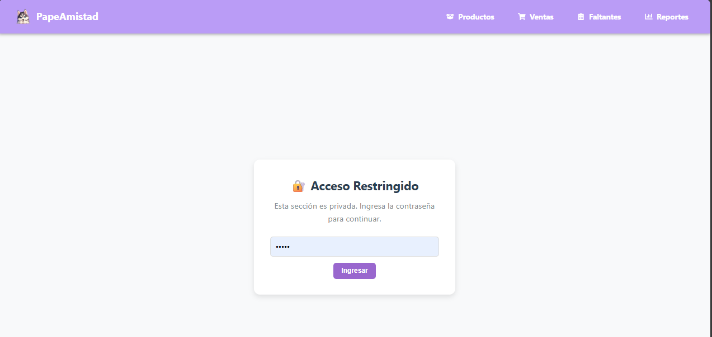
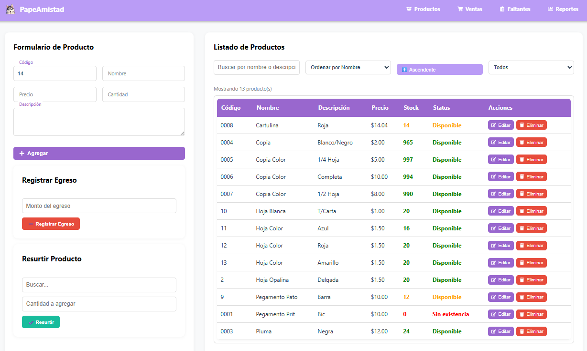
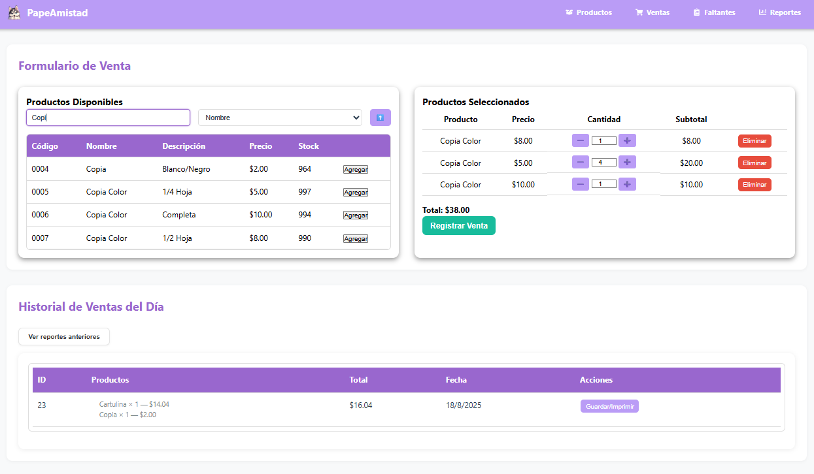
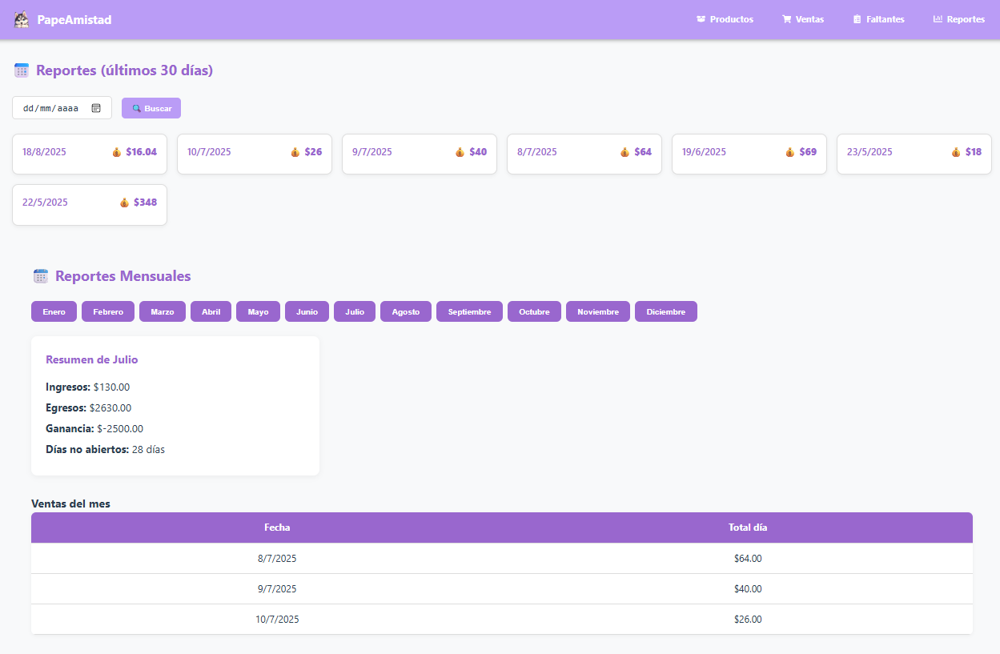
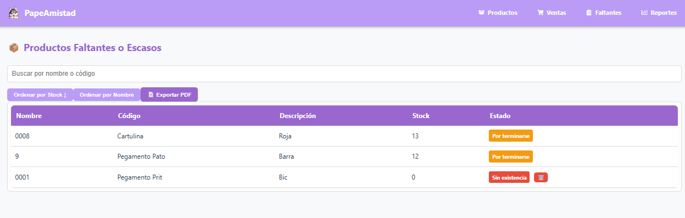
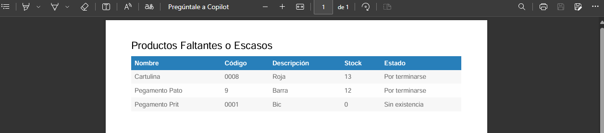

# 📦 Sistema de Punto de Venta (POS) - React + Node.js

Este es un **Sistema de Punto de Venta (POS)** desarrollado como proyecto personal, orientado a pequeñas y medianas empresas como papelerías, tiendas o negocios locales. Permite gestionar productos, ventas, stock, reportes e ingresos/egresos de forma organizada y simple desde una interfaz web.

## 🛠️ Tecnologías utilizadas

**Frontend:**  
- React  
- CSS modularizado  
- Componentes reutilizables (input, tabla, botón, etc.)  
- Axios para comunicación con la API
- 
**Backend:**  
- Node.js + Express  
- PostgreSQL como base de datos  
- Controladores REST  
- Rutas protegidas y estructuradas por módulos

## ⚙️ Funcionalidades principales

- ✅ Gestión completa de productos (CRUD)  
- ✅ Registro y control de ventas diarias  
- ✅ Historial de ventas y filtrado por fechas  
- ✅ Reporte mensual con ingresos, egresos y días no operados  
- ✅ Módulo de egresos para resurtir inventario  
- ✅ Filtros por estado de stock: disponible, por terminar, sin existencia  
- ✅ Buscador por nombre o descripción  
- ✅ Tablas ordenables y responsivas  
- ✅ Diseño para escritorio con estilo limpio y adaptable

## 📸 Capturas del sistema

### 🛒 Vista de Productos

### 💳 Vista de Ventas

### 📊 Vista de Reportes

### ⚠️ Vista de Faltantes

### 📄 Generación de PDF en Faltantes

## 👤 Autor

**Jonathan Gr**  
Desarrollador Web Full Stack  
GitHub: [JonathanGr18](https://github.com/JonathanGr18)

## 📝 Licencia

Este proyecto fue desarrollado con fines educativos y personales.  
Puedes usarlo, adaptarlo o extenderlo libremente. Se recomienda citar al autor en proyectos derivados.
